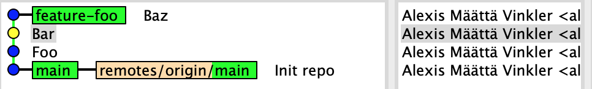

# Lab 2 - Undoing changes
As a developer you're occasionally faced with the need to undo (or rather redo) a series of commits – just like the original poster of [this](https://stackoverflow.com/questions/927358/how-do-i-undo-the-most-recent-local-commits-in-git) Stack Overflow question (with over 10M views).

Common reasons for wanting to undo changes are:
- Accidentally committing unwanted files, such as logs, binaries, or libraries, never intended for source code management
- Embarassing typo in commit message
- Committing changes on the wrong branch, e.g. straight in `main` instead of in a feature branch.

In this assignment you'll learn how to rework your history based on these common problems.

## Purpose & Goal
- Get comfortable undoing changes and rework your git history
- Deepen your knowledge about `remote` vs `local` branches, and `remote` vs `local` repositories
- Learn about "do's and dont's" related to rewriting public histories
- Understand the difference between `log` and `reflog`

## Expectations
- Work in pairs
- For actions/operations performed on one computer – pair program!

## The assignment

### Amend last commit
1. Fork and clone [THIS](https://foo.com) repo, and create a new branch off `develop`
1. Edit [/src/index.html](./src/index.html) by changing the content of the first paragraph. Add the change and commmit it, make sure to write a bad commit message (the idea is to rewrite this later); don't push your change to remote.
1. **Note** the unique commit hash for the just created commit, for example using:
  ```
  $ git show HEAD --no-patch
  ```
  and check the source tree using `gitk`

1. Now amend the commit using
  ```
  $ git commit --amend
  ```
  Your default editor (which is most likely going to be [vi](https://en.wikipedia.org/wiki/Vi) or [vim](https://en.wikipedia.org/wiki/Vim_(text_editor))) will open, showing information about the last commit.

1. Edit the commit message and finalize the process by saving and closing the file.
1. View the last commit again using:
  ```
  $ git show HEAD --no-patch
  ```
  and compare the hash with the previous one.

  ❓ **Why do they differ? And where did the old misspelled commit go?**

1. Launch `gitk` again and provide the `--reflog` flag, or use the regular `reflog`, see if you can find the now orphaned old commit containing the misspelled message.

  ```
  $ gitk --reflog

  # or
  $ git reflog
  ```

1. With the orphaned commit identified, push the branch to the remote repo.

Congratulations, you have now completed the first part of this assignment! 🎉

### Move branches/commits (committed in wrong branch) and reset original branch
1. Switch to the `main` branch in THIS repo.
1. Open the file [foo.html](./foo.html) and edit the first paragraph; commit your changes (but don't push it).
1. Now make two additional changes to the file, make sure to commit the changes in two separate commits (don't push them).

You should now have a history where you're three commits ahead of origin, `git status` should tell you this.

  ```
  $ git status

  On branch main
  Your branch is ahead of 'origin/main' by 3 commits.
    (use "git push" to publish your local commits)

  nothing to commit, working tree clean
  ```

#### Resetting main
Let's say we now realize that our three commits where committed on the wrong branch, i.e. straight onto `main` instead of a feature branch. We now need to "move" the existing commits onto a new branch, and reset our local `main` branch to be in synch with **_origin_**.

1. Create a new feature branch from the tip of `main`, and call it something descriptive, using:
  ```
  E.g.
  $ git branch feature-foo main
  ```
  Above command creates a new branch named `feature-foo` from where `main` is at, but without switching to it.

1.  Verify that the branch got created correctly by viewing your latest commit.
  ```
  E.g.
  $ git show main --no-patch --oneline
  501d07c (HEAD -> main, feature-foo) Foo
  ```
  

1. Push your **new** branch to the remote repo, so it's safely stored on the server as well (but don't push **main**).

1. With the commits stored in your new branch, it's now time to reset *main* so it's in synch with origin. Or in other words, move our local `main` branch back to point to the same commit as **_origin/main_**.
  ```
  E.g.
  $ git reset origin/main
  ```

  You are all done when history looks like this:
  

  and `git status` tells you:
  ```
  $ git status
  On branch main
  Your branch is up to date with 'origin/main'.

  nothing to commit, working tree clean
  ```

  ❓ **How does the outcome differ if you use `--soft`, `--hard` or `--mixed` (default when flag is omitted) when performing the `reset` action?**

### Rewriting a public history
Consider the `super-cool-feature` branch. It has 5 commit and stems of `main`. However, the third commit (`super-cool-feature~3`) counting from the top contains an accidentally committed huge log file. Before this branch can be merged with `main` it needs to have the log file removed completely, to not bloat the repo for all eternity.

Your job is to clear the file from the branch (and repo) using an interactive rebase.

1. Switch to `super-cool-feature` and verify you can see the [src/tmp.log](./src/tmp.log) file in your Working Tree.

1. Rebase the branch on the same commit it already stems from, e.g. the `main` branch.
  ```
  $ git rebase main --interactive
  ```
  

  In the "prompt" (which is in fact a temporary file), change from `pick` to `edit` infront of the offending commit. Save and close the "prompt". If you have not changed your default editor, this is most likely going to be [vi](https://en.wikipedia.org/wiki/Vi) or [vim](https://en.wikipedia.org/wiki/Vim_(text_editor))

1. Git has now dropped you on the offending commit. You can view the state either from `gitk` or using `git status`.
  ```
  $ git rebase main --interactive

  Stopped at bd1ee80...  Bar # empty
  You can amend the commit now, with

      git commit --amend

  Once you are satisfied with your changes, run

      git rebase --continue
  ```
  

  ```
  $ git status
  interactive rebase in progress; onto 04acbc7
  Last commands done (2 commands done):
     pick 4bbc252 Foo # empty
     edit bd1ee80 Bar # empty
  Next command to do (1 remaining command):
     pick 501d07c Baz # empty
    (use "git rebase --edit-todo" to view and edit)
  You are currently editing a commit while rebasing branch 'feature-foo' on '04acbc7'.
    (use "git commit --amend" to amend the current commit)
    (use "git rebase --continue" once you are satisfied with your changes)

  nothing to commit, working tree clean
  ```

1. You are now able to edit the content of the commit, and remove the log-file. For example using:
  ```
  $ git rm ./src/tmp.log
  ```

1. With the removal action completed, continue the rebase process with `git rebase --continue`.

1. With the rebase completed, view your history again using `gitk`. ❓ **Why are only the final three commits diverging, when the rebase was started with main as starting point?**

1. Now we need to update the remote reference... git status...
