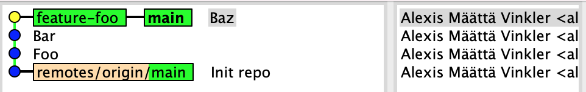
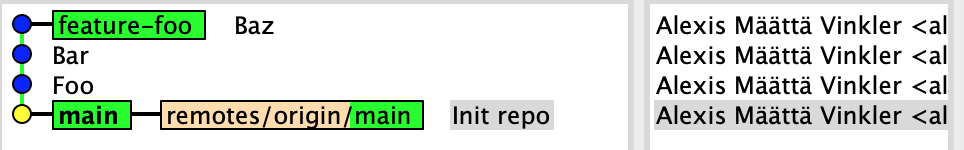

# Lab 2 - Undoing changes
As a developer you're occasionally faced with the need to undo (or rather redo) a series of commits – just like the original poster of [this](https://stackoverflow.com/questions/927358/how-do-i-undo-the-most-recent-local-commits-in-git) Stack Overflow question (with over 10M views).

Common reasons for wanting to undo changes are:
- Accidentally committed files, such as logs, binaries, or libraries, never intended for source code management
- Embarassing typo in commit message
- Committing changes on the wrong branch, e.g. straight in `main` instead of in a feature branch.

In this assignment you'll learn how to rework your history based on some common problems.

## Purpose & Goal
- Get comfortable undoing changes and rework your git history
- Deepen your knowledge about `remote` vs `local` branches and `remote` vs `local` repositories
- Learn about do's and dont's related to rewriting public histories
- Understand the difference between `log` and `reflog`

## Expectations
- Work in pairs
- For actions/operations performed on one computer – pair program!

## The assignment

### Amend last commit (local)
1. Edit a file and write a bad commit message (the idea is to rewrite this later); don't push it to remote.
1. Note the unique commit hash for the just created commit, for example using:
  ```
  $ git show HEAD --no-patch
  ```
and check the source tree using `gitk`

1. Now amend the commits using
  ```
  $ git commit --amend
  ```
1. Edit the commit message and finalize the process
1. View the last commit again using:
  ```
  $ git show HEAD --no-patch
  ```
and compare the hash with the previous one. ❓ **Why do they differ? And where did the old misspelled commit go?**

1. Launch `gitk` again and provide the `--reflog` flag, or use the regular `reflog`, see if you can find the now orphaned old commit containing the misspelled message.

  ```
  $ gitk --reflog

  # or
  $ git reflog
  ```

1. With the orphaned commit identified, push the branch to the remote repo.

### Move branches/commits (committed in wrong branch) and reset original branch
1. Switch to the `main` branch in THIS repo.
1. Open the file [foo.html](./foo.html) and edit the first paragraph; commit your changes (but don't push it).
1. Now make two additional changes to the file, make sure to commit the changes in two separate commits (don't push them).

You should now have a history where you're three commits ahead of origin, `git status` should tell you this.

  ```
  $ git status

  On branch main
  Your branch is ahead of 'origin/main' by 3 commits.
    (use "git push" to publish your local commits)

  nothing to commit, working tree clean
  ```

#### Resetting main
Let's say we now realize that our three commits where committed on the wrong branch, i.e. straight onto `main` instead of a feature branch. We now need to "move" the existing commits onto a new branch, and reset our local `main` branch to be in synch with **_origin_**.

1. Create a new feature branch from the tip of `main`, and call it something descriptive, using:
  ```
  E.g.
  $ git branch feature-foo main
  ```
  Above command creates a new branch named `feature-foo` from where `main` is at, but without switching to it.

1.  Verify that the branch got created correctly by viewing your latest commit.
  ```
  E.g.
  $ git show main --no-patch --oneline
  501d07c (HEAD -> main, feature-foo) Foo
  ```
  

1. Push your **new** branch to the remote repo, so it's safely stored on the server as well (but don't push **main**).

1. With the commits stored in your new branch, it's now time to reset *main* so it's in synch with origin. Or in other words, move our local `main` branch back to point to the same commit as **_origin/main_**.
  ```
  E.g.
  $ git reset origin/main
  ```

  You are all done when history looks like this:
  

  and `git status` tells you:
  ```
  $ git status
  On branch main
  Your branch is up to date with 'origin/main'.

  nothing to commit, working tree clean
  ```

  ❓ **How does the outcome differ if you use `--soft`, `--hard` or `--mixed` (default when flag is omitted) when performing the `reset` action?**

### Interactive rebase of remote branch (squash commits)
